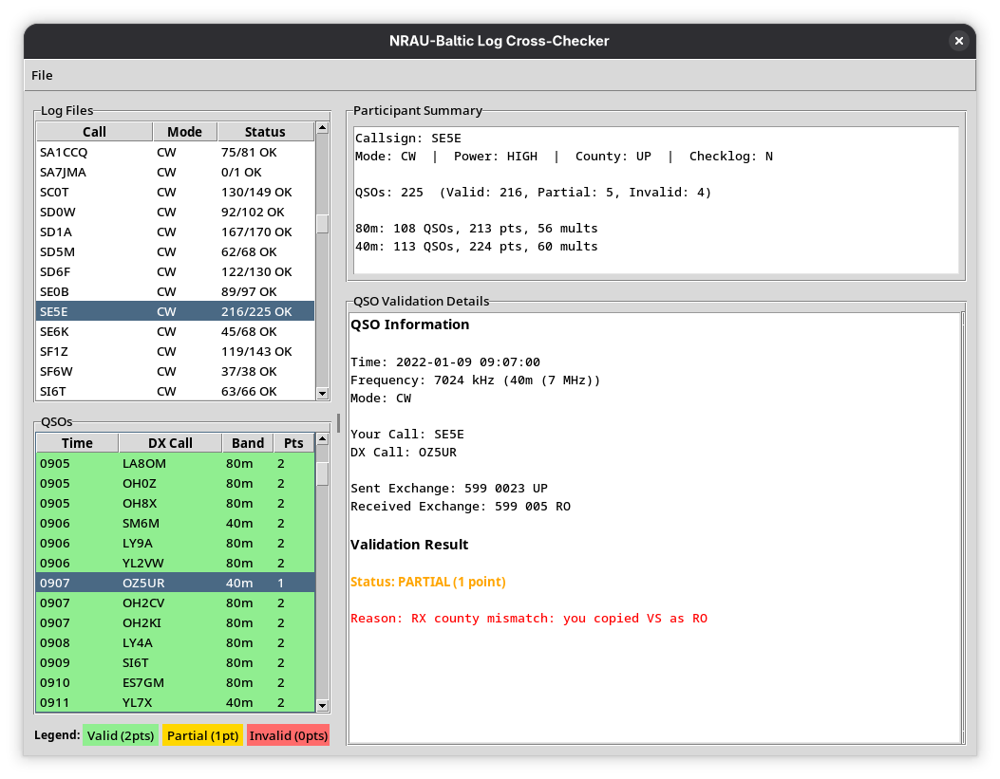

# NRAU-Baltic log cross-checking robot

## Welcome



This robot is capable of cross-checking the NRAU-Baltic ham radio contest logs for basic 
rule violations.

## Requirements

The script uses the `cabrillo.parser` library and only supports Cabrillo version 3.0 and above

## Installation

Run this:

```
python -m venv venv
source venv/bin/activate
pip install -r requirements.txt
```

## Usage

GUI application: run the `gui.py` app. Load CW and PH logs, validate and export results as CSV.

Run the `check.py` script and for each submitted participant log file, it will generate an error
report and place it in the respective folder (`CW` or `PH`)

The `check.py` script generates a CSV file in the standard output, with the following columns:

* MODE (PH, CW)
* CALL
* QSO_COUNT_80m (final, not claimed)
* QSO_COUNT_40m (final, not claimed)
* POINT_80m (final, not claimed)
* POINT_40m (final, not claimed)
* MULT_80m (final, not claimed)
* MULT_40m (final, not claimed)
* SCORE (final, not claimed)
* POWER (HIGH, LOW, MULTI)
* COUNTY (2 letters)
* CHECKLOG (Y, N)
